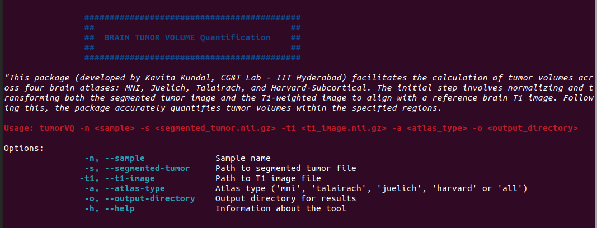

# tumorVQ : Tumor Volume Quantification
    


**tumorVQ** is a package designed for the accurate quantification of **brain tumor volumes** from different brain regions using MRI scans. It provides user-friendly functions for volumetric analysis, integrating standard atlases and offering efficient data for radiogenomics research.

---

## Prerequisites

**Note:** This package will only run on Unix/Ubuntu systems and has not been developed for other operating systems.

Before using **tumorVQ**, ensure you have the following installed and set up:

1. **[FSL](https://fsl.fmrib.ox.ac.uk/fsl/docs/#/install/linux)**installed on your system (folder name: `fsl`)
2. T1 MRI images for accurate outputs
3. Segmented tumor images

---

## Usage

To install **tumorVQ**, follow these steps:

### Clone the Repository

Run the following command in your terminal:

```bash
git clone https://github.com/CGnTLab/tumorVQ.git
```
### Navigate to the Directory
```bash
cd tumorVQ
```

### Run the Installation Script
```bash
./install.sh
```
*Close the current terminal and reopen it for the environment changes to take effect.*

#### To check if tumorVQ is installed correctly, run the following command:
```bash
tumorVQ -h
```
Following will be displayed:



### Volume Extraction Command
```bash
tumorVQ -n SampleName -s /path/to/TumorSegment.nii.gz -t1 /path/to/MRI_t1.nii.gz -a atlas -o /path/to/output
```

### Example Code

Here’s an example of how to use tumorVQ:
```bash
tumorVQ -n Sample1 -s ./data/example/Sample1/Sample1_seg.nii.gz -t1 ./data/example/Sample1/Sample1_t1.nii.gz -a all -o ./Sample1_output
```
---
### Output Interpretation
#### [Atlases Used](https://fsl.fmrib.ox.ac.uk/fsl/docs/#/other/datasets)

**MNI** atlas : 9 Brain Regions (approx 2min)

**Juelich** atlas : 121 Brain Regions (approx 3min)

**Talairach** atlas : 1105 Brain Regions (approx 15min)

**Harvard-Subcoritcal** : 21 Brain Regions (approx 2min)

*All altases will take 15min for successful completion*

Output table will have three columns:

| Regions | Volume | Volume.00 |
|---------|--------|-----------|


---
## Developer

**Kavita Kundal**  
**CG&T Lab, Indian Institute of Technology Hyderabad**


